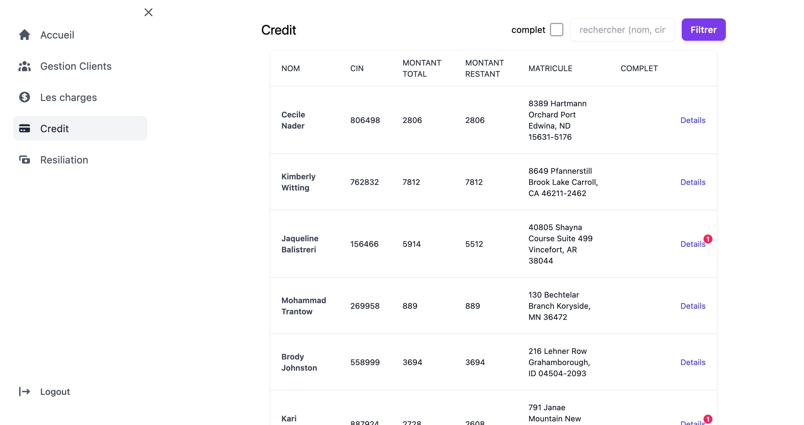

# InsureFlow: Assurance Agency Management System
**Overview:**
InsureFlow is a comprehensive Assurance Agency Management System completed during the last year of my studies at [ESTM](http://www.est-umi.ac.ma/) school in 2021. InsureFlow streamlines the management of clients, credit, credit payments, contracts, vehicles, and agency charges. It offers a user-friendly interface for seamless navigation, robust security measures, and a powerful set of features tailored for the insurance industry.

**Used Technologies:**
- [Laravel](https://laravel.com/)
- [Inertia.js](https://inertiajs.com/)
- [Svelte](https://svelte.dev/)
- [Tailwind CSS](https://tailwindcss.com/) and [Bulma](https://bulma.io/) for styling

**Prerequisites:**
Before you begin, ensure you have the following prerequisites installed:

- [PHP](https://www.php.net/) (>= 7.4)
- [Composer](https://getcomposer.org/) (for PHP dependencies)
- [Yarn](https://yarnpkg.com/) (for JavaScript dependencies)
- [Docker](https://www.docker.com/) (optional, for containerized development)

**Getting Started:**

1. Clone the repository: git clone https://github.com/mzarhou/InsureFlow.git
2. setup the project: `./setup`
3. Run the server: `php artisan serve`

After completing the setup, you can use the following testing credentials:
- Email: ```example@gmail.com```
- Password: ```example```

The development server will be running at [http://127.0.0.1:8000](http://127.0.0.1:8000).


**Screenshots:**
- Login


- Accueil


- Gestion des clients


- Gestion des charges


- Credit



- Resiliation

